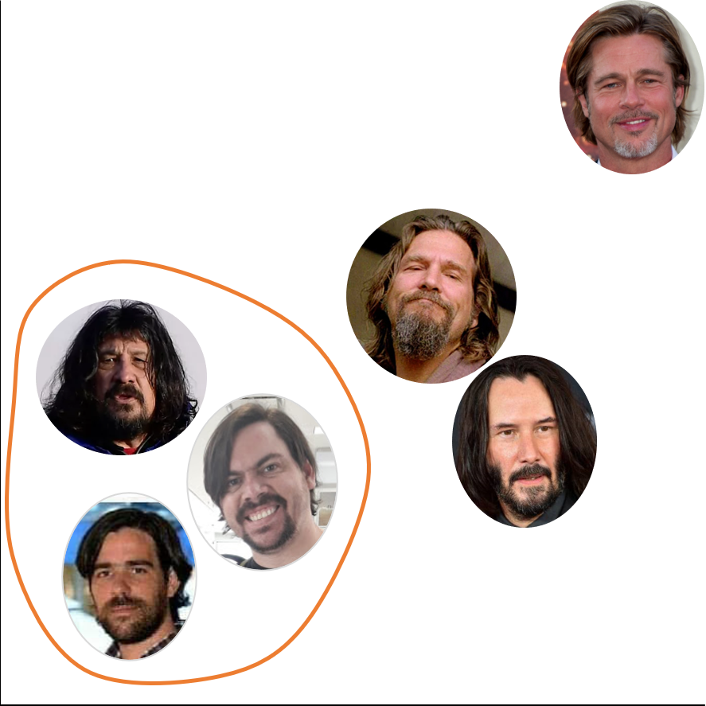

```{r setup, include=FALSE}
options(htmltools.dir.version = FALSE)
knitr::opts_chunk$set(fig.retina = 3, warning = FALSE, message = FALSE)
```

```{r xaringan-themer, include=FALSE, warning=FALSE}
library(xaringanthemer)
style_duo_accent(
  primary_color = "#03162C",
  secondary_color = "#0256B6",
  inverse_header_color = "#FFFFFF",
  header_font_google = google_font("Nunito", "300"),
  text_font_google   = google_font("Roboto", "220", "220i"),
  code_font_google   = google_font("Fira Mono")
)
```

# Sergio García Mora

.left-column[

]

.right-column[
* ### `r emo::ji("geek")` HR Nerd
* `r emo::ji("biceps")` Lic. en Relaciones del Trabajo con formación en Data Mining
* `r emo::ji("airplane")` Fundador de [Data 4HR](https://data-4hr.com/)
* `r emo::ji("chart")` SME People Analytics en [Data IQ](https://dataiq.com.ar/)
* `r emo::ji("teacher")` Profesor de People Analytics en ITBA
* `r emo::ji("wine")` Fundador del [Club de R para RRHH](https://r4hr.club)
* `r emo::ji("king")` Meme Manager en varias comunidades

]
---

.pull-left[
En alguna época solía bromear con que era parecido a [Nicolás del Caño](https://www.xn--nicolasdelcao-tkb.com.ar/)
<br>

]

--

.pull-right[
Pero los datos dicen otra cosa...
```{r knn, echo=FALSE}
library(tidyverse)
library(ggimage)

clones <- read_delim("https://raw.githubusercontent.com/chechoid/humanosReales/main/Datos/clones.csv",
                     delim = ";")

# Agregar columna de ID
clones$id <- rep(1:nrow(clones))

# Eliminar columnas innecesarias
clones <- clones %>% 
  select(-"Marca temporal", -"Poné lo que quieras... parecidos, chistes, comentarios, etc...")

# Pivotear variables
clones <- clones %>% 
  select(id, everything()) %>% 
  pivot_longer(cols = c("Facha de Keanu": "Copadez de Javier"),
               names_to = "personaje",
               values_to = "puntaje")


# Separar variables categóricas
clones <- clones %>% 
  mutate(personaje = str_remove(personaje, "de "),
         personaje = str_remove(personaje, "del "))


clones <- clones %>% 
  separate(personaje,  into = c("metrica", "persona"))


# Pivotear ancho 

clones <- clones %>% 
  pivot_wider(id_cols = c(id, persona),
              names_from = metrica,
              values_from = puntaje)


resultados <- clones %>% 
  group_by(persona) %>% 
  summarise(facha_promedio = mean(Facha),
            copadez_promedio = mean(Copadez))


## Creo un dataframe de las fotos ----
persona <- resultados %>% 
  select(persona) %>% 
  pull()

# Creo un vector de imágenes
ruta <- "knn"        # Ruta de las fotos
extension <- "png"   # Extensión de los archivos de imágenes

# nombres de los archivos
imagen <- c("Ben", "Brad", "Javier", "jeff", "keanu", "mono", "nico", 
            "ricky", "roberto", "russell", "sergio")

# Creo el vector de fotos con dirección y extensión completa
foto <- str_c(ruta, imagen, sep = "/")
foto <- str_c(foto, extension, sep = ".")

# Creo el dataframe y lo agrego al dataframe resultados
pics <- data.frame(persona, foto)

resultados <- left_join(resultados, pics)


ggplot(resultados, aes(x = copadez_promedio, y = facha_promedio)) +
  geom_image(aes(image=foto), size = 0.09) +
  theme_minimal() +
  scale_x_continuous(limits = c(1,10)) +
  scale_y_continuous(limits = c(1,10)) +
  labs(title = "Datos, no opinión",
       x = "Copadez",
       y = "Facha",
       caption = "Datos relevados entre el 23 y el 28 de junio de 2021\nNinguna tía estuvo involucrada en el relevamiento")


```

]
---
class: inverse center middle
# ¿Qué es R y para qué sirve en RRHH?


---
# ¿Qué es R?

**R** es un lenguaje de código abierto, que se hizo conocido inicialmente como un lenguaje de análisis estadístico.

--

Hoy en día, y gracias a la comunidad de desarrolladores quienes expandieron sus capacidades, se puede usar R para muchas cosas más.

--

Los principales usuarios de R vienen de muchas profesiones que mayormente no está relacionada con las Ciencias de la Computación, de ahí que se prioriza la usabilidad del código, la reproducibilidad de los proyectos, a veces en desmedro de la performance, pero con una diversidad de paquetes y aplicaciones que hacen más simple la curva de aprendizaje.

--

En R podés trabajar con cualquier tipo de datos, y hacer todo tipo de análisis que se te ocurra.

---
## Análisis de Clusters

.pull-left[
Los análisis de clusters son útiles para encontrar grupos (clusters) entre los datos.
```{r cluster1, echo = FALSE, out.width="80%"}
# Cargo los datos desde un repositorio de github
datos_rh <- read_csv("https://raw.githubusercontent.com/mlambolla/Analytics_HR_Attrition/master/HR_comma_sep.csv")

# Gráfico de dispersión de Desempeño vs. Satisfacción
ggplot(datos_rh, aes(x = last_evaluation, y = satisfaction_level, color = factor(left)))+
  geom_point(alpha = 0.8)+
  scale_color_manual(values = c("#BFC9CA","#2874A6"))+
  labs(title = "Niveles de Desempeño y de Satisfacción",
       subtitle = "0 = Empleados Activos, 1 = Renuncias",
       x= "Desempeño",
       y= "Satisfacción",
       color = "Estado del\nEmpleado")
```

]

.pull-right[
```{r cluster2, echo=FALSE}
library(ggthemes)

# Seleccionamos las variables para elegir los clusters
variables_cluster <- datos_rh %>%
  select(last_evaluation, satisfaction_level)

# Preparo los datos para hacer el cálculo
vc <- scale(variables_cluster)

# Corro el algoritmo de clustering k-means  
fit_vc <- kmeans(vc, 3)

# Agrego los clusters ajustados (calculados) al dataset
datos_rh$cluster <- fit_vc$cluster


# Gráfico de clusters
ggplot(datos_rh, aes(x = last_evaluation, y = satisfaction_level, color = factor(cluster)))+
  geom_point(alpha = 0.8)+
  scale_color_colorblind()+
  labs(title = "Clusters de Empleados según Desempeño y Satisfacción",
       subtitle = "Clusters definidos mediante el algoritmo de k-means",
       x= "Desempeño",
       y= "Satisfacción",
       color = "Cluster") +
  theme_light()
```

]

---
## Organizational Network Analysis

.pull-left[
```{r ona, echo=FALSE}
library(igraph)
library(readr)
library(visNetwork)
library(networkD3)


#### Datos ####

contactos <- read_delim("https://raw.githubusercontent.com/chechoid/paw21-coding-in-r-live-to-tell/main/data/contactos.csv",
                        delim = ";")

data_scientist <- contactos %>% 
  filter(str_detect(Position, "data.scientist")|str_detect(Position, "data.analyst|analytics"))


origen <- data_scientist %>% 
  distinct(Origen) %>% 
  rename(label=Origen)

contacto <- data_scientist %>% 
  distinct(nombre_apellido) %>% 
  rename(label=nombre_apellido)

nodes <- full_join(origen, contacto, by = "label")

nodes <- nodes %>% rowid_to_column("id")

conexion <- data_scientist %>% 
  group_by(Origen, nombre_apellido) %>% 
  summarise(peso = n()) %>% 
  ungroup()

aristas <- conexion %>% 
  left_join(nodes, by = c("Origen" = "label")) %>% 
  rename(from = id)

aristas <- aristas %>% 
  left_join(nodes, by = c("nombre_apellido" = "label")) %>% 
  rename(to = id)


aristas <- select(aristas, from, to, peso)


edges <- mutate(aristas, width = peso/5 + 1)

nodes$color <- c(rep("#DD6B06", 3), rep("#2CAFBB", 261))


referidos <- visNetwork(nodes, aristas) %>% 
  visIgraphLayout(layout = "layout_with_fr") %>% 
    visNodes(color = list(background = "#5DBAC3",
                        border = "#01636D")) %>% 
  visEdges(color = list(color = "grey", highlight = "#014D54" )) %>% 
  visOptions(highlightNearest = TRUE)

referidos

```

]

.pull-right[

Se pueden hacer análisis de grafos para desarrollar proyectos de Organizational Network Analysis.

En este sencillo ejemplo, estamos analizando las conecciones de LinkedIn de 3 profesores de People Analytics, para detectar los Data Scientists que tenemos en común. Este análisis se puede usar para desarrollar un programa de referidos. `r emo::ji("exploding_head")`

]

---
## Text Mining

Se puede analizar el texto de encuestas, curriculum vitaes, y opiniones de sitios como Glassdoor. Este es un ejemplo de una encuesta sobre Home Office del año pasado.

.pull-left[
```{r tm1, echo=FALSE, out.width="70%"}
library(reshape2)

EncuestaHomeOffice <- read_delim("https://raw.githubusercontent.com/chechoid/humanosReales/main/Datos/encuesta_home_office.csv",
                                 delim = ";")


EncuestaHomeOffice <- EncuestaHomeOffice %>% 
  select("¿Creés que va a cambiar la forma de trabajar después de esta crisis?",
         "Justifica la respuesta")

#### Limpieza de Datos ####

# Cambio los nombres de las variables para hacerlo más manejable
hos <- EncuestaHomeOffice %>%
  rename("Cambios_Futuros" = "¿Creés que va a cambiar la forma de trabajar después de esta crisis?",
         "Comentarios" = "Justifica la respuesta")

# Text Mining 
# Fuente: http://www.aic.uva.es/cuentapalabras/palabras-vacias.html

library(tidytext)
library(wordcloud2)


zx <- theme(panel.background = element_blank(),
            panel.grid.major.x = element_line(colour = "#F4F6F6"),
            axis.line = element_line(colour = "grey"))


eho_text <- hos %>%
  select(Cambios_Futuros, Comentarios) %>%
  filter(!is.na(Comentarios)) %>%
  mutate(Comentarios = as.character(Comentarios))

eho_text_pal <- eho_text %>%
  unnest_tokens(palabra, Comentarios)


# Un lexicon más exhaustivo y detallado
vacias <- read_csv("https://raw.githubusercontent.com/7PartidasDigital/AnaText/master/datos/diccionarios/vacias.txt",
                   locale = default_locale())


# Hacer un anti_join para eliminar las palabras del corpus que están en el listado del lexicon
eho_text_vacio <- eho_text_pal %>%
  anti_join(vacias)


# Si quiero armar un listado específico de palabras para eliminar del análisis, luego uso un anti_join
vacias_adhoc <- tibble(palabra = c("trabajo", "home", "office", "van", "va"))

# Hay varias palabras que se repiten y que no aportan mucho valor así que las elimino.
eho_text_vacio <- eho_text_vacio %>%
  anti_join(vacias_adhoc)

# Ordeno los comentarios en base a la variable "Cambios_Futuros"
library(forcats)

eho_text_vacio$Cambios_Futuros <- fct_relevel(eho_text_vacio$Cambios_Futuros, "Sí", "Tal vez", "No")

# Lexicon de sentimientos
sentimientos <- read_tsv("https://raw.githubusercontent.com/7PartidasDigital/AnaText/master/datos/diccionarios/sentimientos_2.txt",
                         col_types = "cccn",
                         locale = default_locale())

# Modificación de la función get_sentiments de tidyverse
source("https://raw.githubusercontent.com/7PartidasDigital/R-LINHD-18/master/get_sentiments.R")

## Análisis General
eho_text_nrc <- eho_text_vacio %>%
  right_join(get_sentiments("nrc")) %>%
  filter(!is.na(sentimiento)) %>%
  count(sentimiento, sort = TRUE)


feelings <- c("negativo", "positivo", "negativo", "negativo", "negativo", "positivo", "positivo", "positivo")

eho_text_nrc %>%
  filter(sentimiento != "negativo", sentimiento !="positivo") %>%
  cbind(feelings) %>%
  ggplot(aes(reorder(sentimiento, n), n, fill = feelings)) +
  geom_bar(stat = "identity", show.legend = FALSE) +
  scale_fill_manual(values = c("#F5B041","#5DADE2"))+
  zx +
  coord_flip() +
  labs(title="Análisis de Sentimiento",
       caption = "Datos propios: Encuesta de Home Office 2020",
       x = "Sentimiento",
       y = "Frecuencia")


```
]

.pull-right[
```{r tm2, echo=FALSE, out.width="75%"}
library(wordcloud2)
library(webshot)

eho_text_vacio %>%
  filter(Cambios_Futuros == "Sí") %>%
  count(palabra, sort = TRUE) %>%
  filter(n >=3) %>% 
  ungroup() %>%
  wordcloud2( size = 0.6, color = rep_len(c("#4445f8", "#7563fa", "#9881fc", "#b59ffe"), nrow(.)))


```

]

---
## Gráficos

En R podés hacer cualquier tipo de gráfico. 

```{r plot1, echo=FALSE, fig.show='hold', out.width="33%"}
library(hrbrthemes) # Agrega estilos predefinidos y paletas de colores
library(ggeconodist)
library(ggthemes)
library(lubridate)
library(scales)

# Plot 1
hr_data <- read_delim("https://raw.githubusercontent.com/chechoid/paw21-coding-in-r-live-to-tell/main/data/HRDataset_v13.csv", 
                      delim = ";")

perf_by_source <- hr_data %>% 
  select(RecruitmentSource, PerfScoreID) %>% 
  group_by(RecruitmentSource) %>% 
  summarise(performance_promedio = mean(PerfScoreID)) %>% 
  arrange(-performance_promedio)

ggplot(perf_by_source, aes(x=performance_promedio, 
                           y = reorder(RecruitmentSource, performance_promedio))) +
  geom_point(color = ft_cols$yellow, size = 2) +
  labs(title="Desempeño Promedio\npor Fuente de Reclutamiento", # Divide el titulo en dos renglones
       y="",
       x="Puntaje Promedio de Desempeño")+
  theme_ft_rc()+
  theme(plot.title.position = "plot")

# Plot 2

expectativas_laborales <- read_delim("https://raw.githubusercontent.com/chechoid/humanosReales/main/Datos/expectativas_laborales.csv", 
                                     delim = ";")

exp_lab <- expectativas_laborales%>%
  rename(Expectativa = Período) %>%
  pivot_longer(-Expectativa, names_to = "Periodo", values_to = "Valor") %>%
  mutate(Periodo = dmy(Periodo),
         Trimestre = quarter(Periodo, with_year = TRUE, fiscal_start = 1),
         Expectativa = factor(Expectativa, levels = c("La dotación aumentará",
                                                      "La dotación disminuirá",
                                                      "La dotación se mantendrá"),
                              labels = c("Aumentará", "Disminuirá", "Sin Cambios"))) %>%
  filter(Trimestre > 2013.04) %>%
  group_by(Trimestre) %>%
  summarise(Exp_Aumento = mean(Valor[Expectativa== "Aumentará"]),
            Exp_Disminuye = mean(Valor[Expectativa== "Disminuirá"]),
            Exp_Igual = mean(Valor[Expectativa == "Sin Cambios"]))

exp_empresaria <- exp_lab %>%
  pivot_longer(-Trimestre, names_to = "Expectativa", values_to = "Valor") %>%
  mutate(Expectativa = factor(Expectativa, levels = c("Exp_Aumento",
                                                      "Exp_Disminuye",
                                                      "Exp_Igual"),
                              labels = c("Aumentará", "Disminuirá", "Sin Cambios"))) %>% 
  filter(Expectativa != "Sin Cambios")


ggplot(exp_empresaria, aes(x = Trimestre, y = Valor,  color = Expectativa)) +
  geom_line(size = 1)+
  scale_color_manual(values = c("#2980B9", "#E67E22", "#BDC3C7"))+
  geom_point()+
  geom_smooth() +
  labs(title = "Promedio de Expectativas Empresarias y Puestos Vacantes por trimestre",
       subtitle = "Fuente: Encuesta de Índicadores Laborales",
       caption = "#30diasdegraficos #RStats_ES",
       x = "Trimestre", y = "Valor (porcentaje)") +
  theme(panel.grid = element_blank(),
        panel.grid.major.y = element_line(color = "#D7DBDD"),
        panel.grid.minor.y = element_line(color = "#D7DBDD"),
        panel.background = element_blank(),
        text = element_text(family = "Lucida Sans Typewriter")) +
  scale_y_continuous(limits = c(0,15))+
  geom_vline(aes(xintercept = 2015.4), linetype = 2, alpha = 0.3)+
  geom_vline(aes(xintercept = 2019.4), linetype = 2, alpha = 0.3)

# Plot 3


rh <- read_delim("https://raw.githubusercontent.com/chechoid/paw21-coding-in-r-live-to-tell/main/data/rh_ar.csv", 
                 delim = ";")


# Preparación 


estilov <- theme(panel.grid = element_blank(),
                 plot.background = element_rect(fill = "#FBFCFC"),
                 panel.background = element_rect(fill = "#FBFCFC"),
                 panel.grid.major.x = element_line(color = "#AEB6BF"),
                 text = element_text(family = "Ubuntu"))


# Compensación vs. Desempeño -

rh <- rh %>% 
  filter(puesto %in% c("Analista", "HRBP", "Responsable",
                       "Jefe", "Gerente")) %>% 
  mutate(performance = as.integer(runif(490, min = 1, max = 4)),
         performance = factor(performance,
                              levels = c(1,2,3),
                              labels = c("Bajo", "Regular", "Top")),
         puesto = factor(puesto, 
                         levels = c("Analista", "HRBP", "Responsable",
                                    "Jefe", "Gerente")))

rh %>% 
  ggplot(aes(x = puesto, y = sueldo_ft)) +
  geom_econodist(width = 0.5) +
  geom_point(aes(y = sueldo_bruto, color = performance), size = 2, alpha = 0.3,
             position = position_jitter(width = 0.2)) +
  scale_color_colorblind() +
  scale_y_continuous(labels = comma_format(big.mark = ".", decimal.mark = ";")) +
  coord_flip() +
  labs(title = "Distribución de Salarios y Desempeño",
       x = "", y = "", color = "Desempeño",
       caption = "Datos de desempeño generados aleatoriamente") +
  estilov

```


---
class: inverse, center, middle
# Literalmente,

--

### En R podés hacer

--

### cualquier tipo de gráfico

---
## En serio... cualquier tipo de gráfico

Créditos: Ashten Anthony: [Guy checking out a girl meme](https://github.com/ashten28/my_ggplots/tree/master/guy_checking_out_a_girl_meme)


```{r meme, echo=FALSE}
# load libraries
library(readr)
library(dplyr)
library(forcats)
library(ggplot2)
library(patchwork)

# read in data - manually created
data <-
  read_csv("https://raw.githubusercontent.com/ashten28/my_ggplots/master/guy_checking_out_a_girl_meme/data.csv") %>% 
  mutate(
    paint = fct_relevel(paint, c("black", "brown", "beige", "white", "black_2", "grey_2",  "red", "blue_2", "beige_3", "blue", "beige_2", "grey"))
    
  )

# start ggplot
p1 <- 
  ggplot(data) +
  # using geom_bar, so didnt cheat (though using geom_tile was much easier)
  geom_bar(
    mapping = aes(x = x, fill = paint),
    width = 1
  ) +
  # set colours for bars
  scale_fill_manual(
    values = c("#24211a", "#593326","#e4a095", "#ffffff", "#24211a", "#93a9b6", "#fa0107", "#0b59b3", "#e4a095", "#0b59b3", "#e4a095","#93a9b6")
  ) +
  # make grid squares
  coord_equal() +
  # coord_polar() +
  # add themes
  theme_bw() +
  theme(
    legend.position = "none",
    axis.title = element_blank(),
    axis.ticks = element_blank(),
    axis.text  = element_blank(),
    panel.grid = element_blank()
  )

# customized legend - create data to be plotted to look like a legend (not recommended)
legend_data <-
  data.frame(
    x = 0,
    y = c(4, 6, 8, 10, 12),
    label = c("Making ggplot\n when Hadley\nasks", "", "Me", "", "Doing useful\n data analysis")
  )

# start ggplot for custom legend
p2 <- 
  ggplot(
    data = legend_data,
    mapping = aes(x = x, y = y)
  ) +
  # using geom_tile to create filled boxes
  geom_tile(
    mapping = aes( fill = label),
    width = 0.4, height = 0.4,
  ) + 
  # using geom_text to place text beside tiles
  geom_text(
    mapping = aes(label = label),
    size = 6,
    nudge_x = 0.4,
    nudge_y = 0,
    hjust = 0,
    vjust = 0.5
  ) + 
  scale_fill_manual(
    values = c("#ffffff", "#93a9b6", "#fa0107", "#0b59b3")
  ) +
  # setting scales to look better/ coord_fixed to make plot narrower
  scale_x_continuous(limits = c(-0.5,3)) +
  scale_y_continuous(limits = c(1, 15)) +
  coord_fixed(ratio = 0.8) +
  # add themes
  theme_void() +
  theme(
    legend.position = "none"
  )

# using patchwork to combine main plot and custom legend
p <- p1 + p2
p

```


---
# R es mucho más que Estadística

R fue concebido como un lenguaje para análisis estadístico... pero hoy en día es mucho más que eso. R tiene muchos paquetes y sus capacidades se han expandido tanto que puede hacer nuestro trabajo cotidiano mucho más fácil.

--

En R podés:

* Unir datos de múltiples fuentes `r emo::ji("juggle")`

--

* Automatizar reportes con `R Markdown` `r emo::ji("cool")`

--

* Hacer presentaciones, como la que estás viendo, con el paquete `xaringan` `r emo::ji("+1")`

--

* `r emo::ji("chart")` Hacer tableros de comando con el paquete `flexdashboard`.


--

* `r emo::ji("rockstar")` Compartir tu trabajo y hacerlo reproducible. 

--

* Escribir libros `r emo::ji("book")`, crear blogs `r emo::ji("bubble")`... y mucho más

---
class: inverse middle center
# `r emo::ji("crystal")` Análisis Predictivos

---
# Análisis Predictivos
## Análisis predictivo de Rotación de Personal

Los análisis predictivos son una de las cosas más potentes que podemos hacer en Analytics, porque nos permite gestionar de cara hacia el futuro.

--

Hay varios tipos de análisis predictivos, hoy en particular nos vamos a centrar en uno para calcular probabilidades usando **regresión logística**.

--

El ejemplo de hoy, lo vamos a usar reciclando un caso de estudio que desarrollamos en Data 4HR en Python, y lo vamos a replicar en R. El caso original lo pueden ver en [este link](https://drive.google.com/file/d/1XcgT0_ovihpYtnqbEDhwu4zjwI4ltx1w/view?usp=sharing) y este es el [repositorio original](https://github.com/mlambolla/Analytics_HR_Attrition) (aprovechen para ver las diferencias en las sintaxis entre R y Python si pueden).


---
# ¿De qué hablamos cuando hablamos de análisis predictivo?

--

El objetivo de los análisis predictivos es detectar patrones, en nuestro caso, patrones en los comportamientos, en las características, y en los datos de los empleados para poder detectar quién tiene más probabilidad de renunciar por ejemplo.

--

Hoy, sin ningún análisis hecho, lo que sabemos de cada empleado es que tiene tanta probabilidad de renunciar, como de no renunciar. O sea que la cosa esta *"fifty-fifty"*, o para ir nerdeando la cosa, con una probabilidad de 0.5.

--

Lo que buscamos con un análisis predictivo es mejorar esa probabilidad.

---

# ¿Qué es hacer un análisis predictivo?

Hacer un análisis no implica acertar el 100% de los casos, sino que es un intento de tener una idea de quiénes tienen más **probabilidad** de irse. ¿Esto quiere decir que alguien que tiene alta probabilidad de renunciar y no lo hace (o viceversa) el modelo está mal?

No. Al menos no necesariamente. ¿Qué es la probabilidad?

---

## Probabilidad

La probabilidad es toda una rama de la estadística en sí misma. Se enfoca en intentar descubrir la certeza (o incertidumbre) de que ocurran las cosas. El resultado de una probabilidad siempre va a dar entre 0 y 1.

--

* Un resultado igual o cercano a **0** implica un evento improbable.

--

* Un resultado igual o cercano a **1** implica una alta probabilidad.

--

¿Qué pasa si ocurre algo improbable, o no ocurre algo con alta probabilidad? Es parte del margen de error inherente a la estadística, y por eso se asume que va a haber errores. El punto es, si repetimos el experimento 100 veces, ¿cuánto acierta el modelo, y con qué precisión?

---

# ¿Cómo se hace un análisis predictivo?

Para hacer análisis predictivos vamos a trabajar con datos del pasado. Tradicionalmente se usa una el 70% de los datos para *entrenar el modelo*, y el 30% de los datos, se los usa para *testear el modelo*. A estos datasets los vamos a llamar **training** y **test** respectivamente.

--


--

La selección de los datos se hace al azar. Así que hay que asegurarse que la proporción de renuncias sea similar en ambos datasets.

---

## ¿Por qué trabajamos con el pasado?

En los ciclos de vida de los proyectos de data mining en general, está establecida como metodología, la metodología **CRISP-DM** (*Cross Industry Standard Process for Data Mining*). En donde:

.pull-left[
Entre la etapa de *Modelado* y la *Puesta en producción* (deployment) hay una etapa de evaluación. Mientras diseñamos el modelo, trabajamos con datos históricos, en la etapa de *Evaluación* vamos probando la precisión del modelo con datos nuevos, y si todo va bien, se poné en producción.
]

.pull-right[

]

---

# Etapas de un modelo predictivo

Los pasos básicos de un análisis predictivo son:

* Definir la variable *target*
--

* Controlar los sesgos de los datos
--

* Explorar los datos
--

* Separar el dataset en **training** y **test**
--

* Correr el modelo
--

* Controlar los resultados
--

* Ajustar y repetir

---
# Nuestro primer modelo predictivo de attrition
## Regresión Logística

La regresión logística, a diferencia de la regresión lineal, en vez de arrojar un valor como resultado (un sueldo, un nivel de satisfacción), arroja una *probabilidad*, es decir que el resultado estará entre uno y cero.

--
<br><br>


---

# Nuestro primer modelo predictivo de attrition
## Los datos

Vamos a usar un dataset *"de juguete"* para facilitar las cosas. El dataset sólo tiene datos *numéricos* y *character* y no tiene datos faltantes.

```{r}
library(readr)
library(tidyverse)

datos_rh <- read_csv("https://raw.githubusercontent.com/mlambolla/Analytics_HR_Attrition/master/HR_comma_sep.csv")

```

---
## Los datos

```{r}
glimpse(datos_rh)
```

---
## Los datos

Controlamos si hay datos nulos.
```{r message=FALSE, warning=FALSE}
any(is.na(datos_rh)) # Para verificar si hay algún dato faltante.

# Elminamos la variable 'sales' y cambiemos los valores de 'salary' a numéricos.
datos_rh <- datos_rh %>% 
  select(-sales) %>%                      # Elimina columna 'sales'
  mutate(salary = as.numeric(case_when(   # Sobrescribe la columna salary reemplazando los valores por números
    salary == 'low' ~ 0,                  # Cuando la variable es 'low' ahora es 0
    salary == 'medium' ~ 1,
    salary == 'high' ~ 2
  )))
```

---
## La variable target

Usualmente, en los modelos predictivos, tenemos una *variable objetivo* a la que llamamos **target**.

Por lo general usamos o una variable numérica o lógica (`TRUE` o `FALSE`) codificada con `1` o `0`. Es una práctica común usar el número 1 para lo que nos interesa saber, en nuestro caso, si la persona de nuestra base de datos, se fue de la compañía. En nuestro caso, la variable *target* es la columna *left*. Veamos en los datos, cuantos empleados se fueron, y cuántos aún permanecen en la compañía.

```{r message=FALSE, warning=FALSE}
datos_rh %>% 
  count(left)
```

<br>
Durante la sesión de hoy vamos a omitir todo el análisis exploratorio, así nos enfocamos en toda la parte del modelo. En la vida real esto **tiene que estar**, así que lo dejamos como desafío para esta semana.

---
## La selección de los datos de training y test

La selección de los datos se hace al azar para construir los datasets de training y de test. O sea que cada vez que corramos todo el script, R va a elegir datos distintos.

Así que una forma de elegir datos al azar, pero que sean siempre los mismos es con la función `set.seed(234)`. Le pueden poner el número que se les ocurra dentro de la función.

```{r eval=FALSE}
set.seed(234)
```

---

## La selección de los datos de training y test

Para dividir el dataset vamos a usar el paquete `caret`. 

```{r message=FALSE, warning=FALSE}
library(caret)

set.seed(234)
modelo_hr <- createDataPartition(y = datos_rh$left, #<<
                                 p = 0.7, #<<
                                 list = FALSE) #<<
```

Analicemos la función `createDataPartition` y sus parámetros:

* **y** representa a la variable *target*. Fíjense que la selección es usando la estructura *nombre_dataframe$nombre_variable_target*.
* **p** es el parámetro para seleccionar el porcentaje de datos que vamos a seleccionar para el training set.
* **list = FALSE** evita que el nuevo objeto sea del tipo **lista**.

Esta función crea un objeto con un índice de todas las filas seleccionadas para los datos de training. Con estos datos de muestra le vamos a pedir al algoritmo que analice los patrones para predecir las renuncias.

> Prueben correr esta función con un set.seed() diferente para ver qué selecciones distintas hubo.

---
## La selección de los datos de training y test


.pull-left[Ahora creamos los dos datasets

```{r warning=FALSE, message=FALSE}
#Armo el dataframe de training [fila, columna]
modelo_hr_train <- datos_rh[modelo_hr,]

# Con el signo - (menos), creamos el dataset de testing, con todas las filas 'que no estén en modelo_hr'
modelo_hr_test <- datos_rh[-modelo_hr,]

```

]


.pull-right[Es una buena práctica chequear que las proporciones de bajas (nuestra variable target) sean similares tanto en training como en test.

```{r}
modelo_hr_train %>%
  summarise(turnover = mean(left))

modelo_hr_test %>%
  summarise(turnover = mean(left))
```

Todo en orden, avancemos.
]

---

## Entrenando el modelo

El primer paso es generar un modelo predictivo con los datos de *training*. *Left* es la variable objetivo, y los símbolos `~ .` significa que el resto del dataset son las variables explicatorias, con excepción de *department* que la sacamos de los cálculos.

```{r}
# Calculamos un modelo de entrenamiento, sacando department de los cálculos.
modelo_glm2 <- glm(left ~. , family = "binomial", #<<
                   data = modelo_hr_train) #<<

```

---

```{r}
summary(modelo_glm2)
```

---

### Chequeando multicolinealidad

En este tipo de modelos, vamos a buscar variables que estén relacionadas, pero de manera independientemente, sin colinealidad.

Si hay colinealidad entre dos variables puede ocurrir porque una variable está construida a partir de otra variable, lo que implica que las variables colineales son de alguna manera, dos expresiones de la misma cosa, o bien, que una variable esté construida a partir de la otra (ejemplos: el índica de masa muscular, un bono de antigüedad, etc.)

Una forma de detectar esto es a través de la función `vif` (Variance Inflation Factor):
```{r message=FALSE, warning=FALSE}
library(car)

vif(modelo_glm2)
```


---

### Chequando multicolinealidad

Para tener en cuenta, tenemos que buscar variables con VIF > 5. Si esto ocurriera, tendríamos que correr los modelos, eliminando estas variables, hasta tener un modelo en el que todas las variables tengan un VIF menor a 5.

```{r echo=F, message=FALSE, warning=FALSE}

VIF <- c(1, "Entre 1 y 5", "5 o más")
Interpretacion <- c("No hay colinealidad", "Moderadamente colineales", "Colinealidad alta")

tabla_vif <- data.frame(VIF, Interpretacion)

knitr::kable(tabla_vif, format = "html") %>% 
  kableExtra::kable_styling(full_width = FALSE, position = "center")
```

---

## Estimando probabilidades

Una vez que tenemos un modelo "entrenado" podemos estimar las probabilidades para los sets de training y de test.

```{r}
pred_train <- predict(modelo_glm2, newdata = modelo_hr_train, type = "response")
```

Luego, lo repetimos la predicción para los datos de test. Lo que obtenemos es un gran listado de probabilidades (asegurarse que los resultados estén entre 0 y 1).

```{r}
pred_test <- predict(modelo_glm2, newdata = modelo_hr_test, type = "response") #<<

pred_test[1:20]
```

---

## Matriz de Confusión

Como primer paso tenemos que añadir las probabilidades del objeto *pred_test* al dataframe de testing.

```{r}
# Asigna las probabilidades a una variable nueva llamada "score".
modelo_hr_test$score <- pred_test

# Luego en base al score, asigno una clase predicha en función a si la probabilidad es mayor a 0.5
modelo_hr_test <- modelo_hr_test %>% 
  mutate(prediccion = ifelse(score > 0.5, 1, 0)) #<<
```

```{r echo=FALSE}
# Este código sólo está para mostrar mejor el resultado
knitr::kable(head(modelo_hr_test, 4), format = 'html') %>% 
  kableExtra::kable_styling(bootstrap_options = "striped",position = "center", font_size = 11)
```

---

## Matriz de Confusión

La matriz de confusión es una tabla de doble entrada en donde lo que hacemos es contrastar los aciertos del modelo, contra los fallos.


---

## Matriz de Confusión

Construyamos una matriz de confusión básica del modelo de testing.

```{r}
conf_matrix <- table(modelo_hr_test$left, modelo_hr_test$prediccion)
conf_matrix
```

En esta matriz vemos que en 3.140 casos, el modelo acertó a empleados que no se fueron, y que acertó en 384 predicciones de empleados que renunciaron. Veamos otras métricas que podemos sacar.

---

## Matriz de Confusión

Para ver otras métricas posibles de la matriz de confusión vamos a usar la función `confusionMatrix` del paquete `caret`.

---

```{r}
confusionMatrix(conf_matrix)
```


---

## Curva ROC

La **curva ROC**, es una forma visual de calcular el **AUC** (*Area Under the Curve*, el área bajo la curva). Internamente lo que hace este gráfico es ordenar las probabilidades de mayor a menor, y a medida que tenemos un *positivo verdadero* (el empleado se fue y nosotros predecimos que se iba) la curva se mueve hacia arriba. Con cada falso positivo, la curva se va moviendo a la derecha.

Para esto vamos a usar la librería `pROC`.

> Video: cómo se construye la curva ROC: [https://youtu.be/OjWew7W4KnY](https://youtu.be/OjWew7W4KnY)

---

## AUC - Area Under the Curve

Una métrica complementaria de la *curva ROC* es el **Área Bajo la Curva** (AUC, por sus siglas en inglés) que refleja la proporción del espacio que hay debajo de la curva ROC en el gráfico.


---

## AUC - Area Under the Curve

Usaremos otra librería para graficar al mismo tiempo la curva ROC, y calcular el AUC.

```{r roc1, message=FALSE, warning=FALSE, fig.show='hide'}
library(pROC)

pROC_obj <- roc(modelo_hr_test$left, modelo_hr_test$score,
                smoothed = FALSE,
                # argumentos del intervalo de confianza
                ci=TRUE, ci.alpha=0.9, stratified=FALSE,
                # argumentos del gráfico
                plot=TRUE, auc.polygon=TRUE, max.auc.polygon=TRUE, grid=TRUE,
                print.auc=TRUE, show.thres=TRUE)

```

---
```{r ref.label='roc1', echo = FALSE, message=FALSE, warning=FALSE, fig.retina=3}

```
---

class: inverse, center, middle


---
class: inverse, center, middle

# ¿Qué tan bueno es el modelo?

---
## "Todos los empleados son iguales pero hay empleados más iguales que otros"

.pull-left[
Algo interesante que surge del análisis exploratorio, son los tres grupos notorios que tenemos entre los empleados que se van.

Tenemos un grupo llamativo, que representan a los empleados de *alto desempeño* y de *alto nivel de satisfacción*.

```{r eval-satis, fig.show='hide', warning=FALSE, message=FALSE}
ggplot(modelo_hr_test, aes(x = last_evaluation, y = satisfaction_level, color = factor(left)))+
  geom_point(alpha = 0.8)+
  scale_color_manual(values = c("#BFC9CA","#2874A6"))
```


]

.pull-right[
```{r ref.label='eval-satis', echo = FALSE, message=FALSE, warning=FALSE, fig.retina=3, out.width="80%"}

```
]

---

class: center, middle

## ¿Qué tan bueno es el modelo con los top de lo top?


---

## ¿Qué tan bueno es el modelo con los top de lo top?

.pull-left[
```{r cluster, fig.show='hide', warning=FALSE, message=FALSE}
# Seleccionamos las variables para elegir los clusters
variables_cluster <- modelo_hr_test %>%
  select(last_evaluation, satisfaction_level)

# Preparo los datos para hacer el cálculo
vc <- scale(variables_cluster)

# Corro el algoritmo de clustering
set.seed(87)
fit_vc <- kmeans(vc, 3)

# Agrego los clusters ajustados (calculados) al dataset
modelo_hr_test$cluster <- fit_vc$cluster

library(ggthemes)
ggplot(modelo_hr_test, aes(x = last_evaluation, y = satisfaction_level, color = factor(cluster)))+
  geom_point(alpha = 0.8)+
  scale_color_colorblind()
```

]

.pull-right[
```{r ref.label='cluster', echo = FALSE, message=FALSE, warning=FALSE, fig.retina=3}

```
]
---

## ¿Qué tan bueno es el modelo con los top de lo top?


```{r}
# Filtramos los datos del cluster 1
modelo_hr_c1 <- modelo_hr_test %>% 
  filter(cluster == 1)

conf_matrix_c1 <- table(modelo_hr_c1$prediccion, modelo_hr_c1$left)

```

---
```{r}
# Veamos todas las métricas de la matriz con esta función del paquete caret
confusionMatrix(conf_matrix_c1)
```

---

.pull-left[
.center[# Muchas gracias!]

]

.pull-right[
Si te gustó esta sesión me pueden encontrar en:

`r fontawesome::fa(name = "linkedin", fill = "blue")` [Sergio Garcia Mora](https://www.linkedin.com/in/sergiogarciamora/)
`r fontawesome::fa(name = "twitter", fill = "blue")` [@sergiogarciamor](https://twitter.com/sergiogarciamor)
`r fontawesome::fa(name = "paper-plane", fill = "blue")` [Telegram](https://t.me/SergioGarciaMora)
`r fontawesome::fa(name = "envelope", fill = "blue")` [sergio@d4hr.com](mailto:sergio@d4hr.com)

Recuerden compartir sus capturas de pantalla y sensaciones con los hashtags:

* #### #R4HR
* #### #data4hr
* #### #PeopleAnalytics
* #### #RStats_ES
* #### #BetterWithData
]
---
background-color: #F0B27A
class: inverse, center, middle

## Seguir al Club de R para RRHH en nuestras redes

### [link.tree/r4hrclub](https://www.linktr.ee/r4hrclub) `r emo::ji("satellite")`


---
# Fuentes de Consulta

Max Kuhn, Libro: [The caret package](https://topepo.github.io/caret/index.html)

Pablo Casas, Libro [Libro Vivo de Ciencia de Datos](https://librovivodecienciadedatos.ai/)


### Regresión logística
https://rpubs.com/Joaquin_AR/229736
https://www.cienciadedatos.net/documentos/27_regresion_logistica_simple_y_multiple


### Curvas ROC
https://rviews.rstudio.com/2019/03/01/some-r-packages-for-roc-curves/

---

# Paquetes utilizados

* [ggplot2](https://ggplot2.tidyverse.org): H. Wickham. ggplot2: Elegant Graphics for Data Analysis. Springer-Verlag New York, 2016.
* [tidyverse](https://doi.org/10.21105/joss.01686): Wickham et al., (2019). Welcome to the tidyverse. Journal of Open Source Software, 4(43), 1686
* [funModeling](https://CRAN.R-project.org/package=funModeling): Pablo Casas (2020). funModeling: Exploratory Data Analysis and Data Preparation Tool-Box. R package version 1.9.4.
* [lubridate](http://www.jstatsoft.org/v40/i03/): Garrett Grolemund, Hadley Wickham (2011). Dates and Times Made Easy with lubridate. Journal of Statistical Software, 40(3), 1-25.
* [ggthemes](https://CRAN.R-project.org/package=ggthemes): Jeffrey B. Arnold (2019). ggthemes: Extra Themes, Scales and Geoms for 'ggplot2'. R package version 4.2.0.
* [gargle](https://CRAN.R-project.org/package=gargle): Jennifer Bryan, Craig Citro and Hadley Wickham (2020). gargle: Utilities for Working with
  Google APIs. R package version 0.5.0.
* [googlesheets4](https://CRAN.R-project.org/package=googlesheets4): Jennifer Bryan (2020). googlesheets4: Access Google Sheets using the Sheets API V4. R package version 0.2.0.
* [caret](https://CRAN.R-project.org/package=caret): Max Kuhn (2020). caret: Classification and Regression Training. R package version 6.0-86.


---
background-color: #CACFD2
class: center, bottom

# `r fontawesome::fa(name = "github-alt", fill = "black")`
[Repo](https://github.com/chechoid/humanosReales)


Presentación realizada con el paquete [Xaringan](https://github.com/yihui/xaringan) desarrollado por Yihui Xie.

Gracias a [Patricia Loto](https://twitter.com/patriloto) por compartir el [tutorial](https://twitter.com/patriloto/status/1260822644590608391?s=20)
