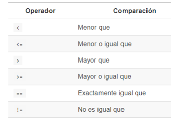

```{r setup, include=FALSE}
options(htmltools.dir.version = FALSE)
knitr::opts_chunk$set(fig.retina = 3, warning = FALSE, message = FALSE)
```

```{r xaringan-themer, include=FALSE, warning=FALSE}
library(xaringanthemer)
style_duo_accent(
  primary_color = "#03162C",
  secondary_color = "#0256B6",
  inverse_header_color = "#FFFFFF",
  header_font_google = google_font("Nunito", "400"),
  text_font_google   = google_font("Roboto", "280", "280i"),
  code_font_google   = google_font("Fira Mono")
)
```

# Sergio García Mora

.left-column[

]

.right-column[
* ### `r emo::ji("geek")` HR Nerd
* `r emo::ji("biceps")` Lic. en Relaciones del Trabajo con formación en Data Mining
* `r emo::ji("airplane")` Fundador de [Data 4HR](https://data-4hr.com/)
* `r emo::ji("chart")` SME People Analytics en [Data IQ](https://dataiq.com.ar/)
* `r emo::ji("teacher")` Profesor de People Analytics en ITBA
* `r emo::ji("wine")` Fundador del [Club de R para RRHH](https://r4hr.club)
* `r emo::ji("king")` Meme Manager en varias comunidades

]


---
background-color: #03162C
class: center middle inverse
# Empecemos!


---
# Proyectos

Trabajar con proyectos en RStudio hace que todo el trabajo sea más sencillo. Los proyectos crean una carpeta en nuestra PC en donde se almacenarán los archivos, tablas, scripts, y hace que todo sea más organizado.

--

Para crear un proyecto tenés podés entrar en:
* *File*
  * *New project*

Y luego poner el nombre de la carpeta.

.pull-left[]


.pull-rigt[]

---
# Tidy Data

Cuando hacemos algún tutorial, los datos están perfectos, limpios, y prolijos. Y cuando querés aplicar el mismo código a tus propios datos, resulta que no funciona, o tenés que hacer mucho procesamiento de datos para terminar replicando un ejemplo de un tutorial.

--

Por estas razones, la limpieza de datos, suele representar entre el 60 al 80% de cualquier proyecto de Analytics, hasta lograr tener **datos ordenados** (tidy data). Entre algunos principios de *tidy data* podemos mencionar dos:

--

1. Cada variable forma una columna.
2. Cada observación forma una fila.
3. Cada tipo de unidad observacional forma una tabla.

---
# dplyr


El paquete **dplyr** es uno de los paquetes embebidos dentro del paquete tidyverse: un conjunto de paquetes destinados a la limpieza y manipulación de datos y que se convirtió en un estándar en la práctica de la limpieza y manipulación de datos en R. `dplyr` fue desarrollado por Hadley Wickham, Romain François, Lionel Henry y Kirill Müller.

Una de las razones por las que se hizo tan popular es por su sintaxis simple, con nombres de funciones que usan palabras muy coloquiales, imitando la forma en la que hablamos.

Usualmente se dice que usamos `dplyr` para hacer *data wrangling*. Así que empecemos a aprender a domar nuestros datos.

<br>

.center[

]

---
# dplyr: Instalación y carga

Al igual que la gran mayoría de los paquetes de R, podemos instalar el paquete directamente desde el script:

```{r eval=FALSE}
# Instalando el paquete individual
install.packages("dplyr")

# Instalando el conjunto de paquetes de tidyverse
install.packages("tidyverse")

```

--

Antes de empezar a usar las funciones de dplyr, tenemos que cargarlo con la función `library()`:
```{r}
library(dplyr)
```

--


.pull-left[
### ¿Cómo nos damos cuenta si un paquete no está cargado?
]

.pull-right[

]

---
class: center

Ahora si...
# A domar datos!


---
# Los cheatsheets
## (machete, cola, trencito, copiatín, plage, batería, torpedo, chuleta, chanchullo, etc.)

Los [*cheatsheet*](https://rstudio.com/resources/cheatsheets/) son documentos con resúmenes de las principales funciones de los paquetes más utilizados.

La comunidad de R de hispanoamérica ha traducido unos cuantos, gracias a quienes podemos contar hoy con un cheatsheet en [castellano](https://github.com/rstudio/cheatsheets/raw/master/translations/spanish/data-wrangling-cheatsheet_Spanish.pdf).

.center[

]

---
# El dataset

Vamos a utilizar una versión abreviada de la `r emo::ji("kiwi")` **Encuesta KIWI de Sueldos de RH** que desarrollamos con el Club de R para RRHH (pueden ver los resultados [en este link](https://rpubs.com/Data4HR/encuesta-kiwi-2020)).

.left-column[


]

.right-column[

```{r carga-datos}
library(dplyr) # Manipulación y limpieza de datos
library(readr) # Lectura y carga de archivos

# Cargamos encuesta de sueldos
encuesta <- read_delim("https://raw.githubusercontent.com/r4hr/r4hr_introduccion_dplyr/main/Datos/encuesta_sueldos.csv", 
                       delim = ",")
```
]

---
## Explorando los datos

Vamos a explorar algunas características del dataset:

```{r eda1}
glimpse(encuesta)
```

---


class: inverse, middle
background-image: url("Archivos/dplyr.png")
background-size: cover

---
# Los "verbos" en dplyr

Una de las razones por las cuales tidyverse se hizo tan popular es que la lógica de las funciones imita el razonamiento que haríamos verbalmente.

--

Por ejemplo, ¿cómo harían para calcular el sueldo promedio por puesto y ordenar los resultados de mayor a menor?

--

```{r ej-1}
encuesta %>% 
  select(puesto, sueldo_bruto) %>% # Selecciona las columnas
  group_by(puesto) %>%     # Agrupa por la variable puesto
  summarise(sueldo_promedio = mean(sueldo_bruto)) %>% # Crea una variable con el sueldo promedio
  arrange(-sueldo_promedio) # Ordena descendentemente los resultados por la variable que pasemos.
```

---
# dplyr: El "pipe"

¿Vieron este símbolo `%>%` en la slide anterior? En la jerga lo conocemos como *"pipe"* (atajo de teclado Ctrl + Mayús + M). Lo que nos permite este *"tubo"* es ordenar el código en secuencias, haciéndolo más comprensible a la lectura.

Una de las ventajas del *pipe* es que no necesitamos invocar al dataframe en cada función que encadenamos en el pipe.

.center[

]

---
## dplyr: Secuencias

Por ejemplo, si quiero ver los sueldos brutos por puesto de las personas que no tienen gente a cargo ordenados por el puesto. Los pasos son:

1. Elegir las variables `puesto`, `sueldo_bruto`, `personas_a_cargo`.
2. Filtrar de la variable `personas_a_cargo` los casos que no tienen gente a cargo.
3. Ordenar los resultados por puesto.

> Acá estoy usando la función `head()` para que quede prolijo en la presentación. Ustedes no la usen y recuerden sacar el último paréntesis

```{r}
head(arrange(filter(select(encuesta, puesto, sueldo_bruto, personas_a_cargo), personas_a_cargo > 0), puesto))
```

---

## dplyr: Secuencias

Esto mismo usando el pipe de dplyr lo hacemos así:
```{r}
encuesta %>% #<<
  select(puesto, sueldo_bruto, personas_a_cargo) %>% #<<
  filter(personas_a_cargo>0) %>% #<<
  arrange(puesto) %>% #<<
  head()
```


---
# ¿Cuál es más fácil de entender?
<br>

### Código sin el *pipe*

```{r eval=FALSE}
arrange(filter(select(encuesta, puesto, sueldo_bruto, personas_a_cargo), personas_a_cargo > 0), puesto)

```


### Código con el *pipe*

```{r eval=FALSE}
encuesta %>%
  select(puesto, sueldo_bruto, personas_a_cargo) %>%
  filter(personas_a_cargo>0) %>%
  arrange(puesto)
```


---
# Las funciones de dplyr

En esta presentación vamos a repasar los siguientes *"verbos"* o funciones:

* **select**: Para elegir las variables para trabajar.
* **filter**: Filtra a las variables por alguna condición que le pasemos.
* **group_by**: Define las variables por las cuales vamos a agrupar los cálculos.
* **summarise**: Permite crear cálculos de resumen estadístico.
* **mutate**: Permite crear variables nuevas en función de variables existentes, o bien sobrescribir una columna para modificar sus características.


Hay muchas funciones más, que pueden explorar en el *cheatsheet*.
---

.left-column[
## select
### filter
### group_by
### summarise
### mutate
]

.right-column[
La función `select()` sirve para elegir las columnas (variables) con las que queremos trabajar. También nos permite traer las columnas en el orden que las necesitemos.

```{r select-1}
encuesta %>% 
  select(satisfaccion, sueldo_bruto) %>% #<<
  head()
```
]

---
## select()

`select()` tiene algunas variantes interesantes (y en general aplican para casi todas las funciones de dplyr).

Supongamos que quiera seleccionar todas las columnas numéricas nada más:


```{r select-2}
encuesta %>%
  select_if(is.numeric) %>% #<<
  head()
```

---

.left-column[
### select
## filter
### group_by
### summarise
### mutate
]

.right-column[

]

---
## filter

`filter()` nos permite obtener las filas (observaciones) que cumplen con las condiciones que necesitamos.

Ej.: Respuestas de Universidades Públicas

```{r filter-1}
encuesta %>%
  # Prestar atención al doble signo igual "=="
  filter(universidad == "Universidad Pública") %>% #<<
  head()
```

---
## filter

`filter()` nos permite obtener las filas (observaciones) que cumplen con las condiciones que necesitamos.

Ej.: Respuestas de trabajadores privados (filtrar todo lo que no sea `Función pública`)
```{r filter-2-not}
encuesta %>%
  # Prestar atención al signo "No igual a "!="
  filter(universidad != "Función pública") %>% #<<
  head()

```

---
## filter: Operadores lógicos

Estas son los operadores lógicos que nos van a ayudar con la función filter.

.center[]
---
## filter()

`filter()` nos permite obtener las filas (observaciones) que cumplen con las condiciones que necesitamos.

Ej.: Listado de respuestas de Universidad Privada y de empresas con más de 700 empleados.

```{r}
# Filtramos los empleados que son de Universidad Privada y de empresas con más de 700 empleados.
encuesta %>%
  filter(universidad == "Universidad Privada" &  empleados > 700) %>% #<<
  head()
```

---
## filter: Operadores lógicos

.pull-left[

Veamos la distribución de los sueldos con un histograma

```{r hist1, fig.show='hide'}
library(ggplot2) 

ggplot(encuesta, aes(x = sueldo_bruto)) + # Defino fuente de datos y variable a graficar
  geom_histogram() +                  # Tipo de gráfico
  ggtitle("Distribución de sueldos brutos") # Agrego título al gráfico
```


]

.pull-right[
`r emo::ji("scream")`

```{r ref.label="hist1", echo=FALSE}

```

]

---
## filter: Operadores lógicos

¿Qué salió mal? Tenemos valores extremos que pueden ser válidos, pero que no son representativos. Exploremos la variable:

```{r}
summary(encuesta$sueldo_bruto)
```

--
Vemos que hay sueldos muy altos, que pueden ser válidos pero que son atípicos. Y también encontramos sueldos muy bajos.

---
## filter: Operadores lógicos

.pull-left[
Podemos filtrar un rango de una variable numérica de la siguiente manera combinando la función `between()`:


```{r hist2, fig.show='hide', message=FALSE, warning=FALSE}
# Creo un objeto nuevo
encuesta_limpia <- encuesta %>% 
  filter(between(sueldo_bruto,   # Variable a filtrar 
                 50000,          # Valor mínimo
                 200000))        # Valor máximo

# Vuelvo a graficar
ggplot(encuesta_limpia, aes(x = sueldo_bruto)) +
  geom_histogram() +
  ggtitle("Distribución de sueldos brutos")
```


]

.pull-right[
`r emo::ji("+1")`

```{r ref.label="hist2", echo=FALSE}

```
]
---

## filter()

`filter()` nos permite obtener las filas (observaciones) que cumplen con las condiciones que necesitamos.

Ej.: Empleados de dos rubros diferentes
```{r}
encuesta %>%
  filter(rubro == "Comercio"| rubro == "Servicios de salud") %>% #<<
  head()
```
 
---
## filter()
Una alternativa es usar un vector de selección
```{r eval = FALSE}
encuesta %>%
  filter(rubro %in% c("Comercio", "Servicios de salud")) #<<
```

---
.left-column[
### select
### filter
## group_by
## summarise
### mutate
]
.right-column[
`group_by()` es una función para agrupar las variables en función de los valores de una o varias columnas. 

Por ejemplo si quiero ver los sueldos promedio por puesto, tengo que agrupar por puesto, y luego calculo el promedio.

Para calcular el promedio voy a necesitar la función `summarise()`, que crea nuevas columnas con medidas de resumen estadístico.
]
---
## group_by y summarise

```{r}
encuesta %>%
  select(puesto, sueldo_bruto) %>%
  # Agrupo por puesto
  group_by(puesto) %>%  #<<
  #Calculo el sueldo promedio
  summarise(sueldo_promedio = mean(sueldo_bruto)) #<<
```
]
---

.left-column[
### select
### filter
### group_by
### summarise
## mutate
]

.right-column[
`mutate()` tiene dos usos principales.

1. Crear nuevas columnas en base a las columnas que ya existen en el dataset. Por ejemplo, para calcular un **sueldo anual** de una columna de **sueldo mensual**.

2. Para modificar las características de una variable. Por ejemplo, para cambiar el tipo de variable, como pasar una variable numérica a tipo `factor` o definir el orden de una variable.

]

---
## mutate: Ejemplos

Calcular el sueldo anual en base a la columna sueldo bruto 

> En Argentina tenemos un bono anual llamado *aguinaldo*, que equivale a un sueldo más y se paga dos veces en el año.

```{r}
encuesta %>%
  select(puesto, sueldo_bruto) %>%
  mutate(sueldo_bruto_anual = sueldo_bruto * 13) %>% #<<
  head()
```
---
## mutate: Ejemplos

Con mutate podemos cambiar las características de algunas variables. Por ejemplo, la variable `puesto` es de tipo `character` o nominal, es decir que no nos permite ordenar sus resultados.

```{r}
class(encuesta$puesto)
```

Si convertimos esta variable en tipo `factor` podremos definir el orden que nos sirva para representar la jerarquía.

---
## mutate: Ejemplos

```{r}
encuesta %>% select(puesto, sueldo_bruto) %>% 
  mutate(puesto = factor(puesto, levels = c("Director", "Gerente", "Jefe", "Responsable", #<<
                                            "HRBP", "Analista", "Administrativo"))) %>%   #<<
  group_by(puesto) %>% summarise(sueldo_promedio = mean(sueldo_bruto))
  
```

---
## mutate + case_when

.left-column[
La función `case_when` la podemos usar dentro de mutate para crear categorías a partir de variables numéricas. 

Usemos esto para crear rangos de empleados, y calcular el sueldo promedio después.
]

.right-column[

```{r}
encuesta <- encuesta %>%  
  mutate(cantidad_empleados = case_when( #<<
    empleados <= 100 ~ "Hasta 100",      #<<
    empleados <= 500 ~ "Hasta 500",      #<<
    empleados <= 1000 ~ "Hasta 1000",    #<<
    empleados <= 5000 ~ "Hasta 5000",    #<<
    empleados = TRUE ~ "Más de 5000"     #<<
  )) 

encuesta %>% 
  group_by(cantidad_empleados) %>% 
  summarise(sueldo_promedio = mean(sueldo_bruto))
```
]


---
class: inverse, middle

# Secuencia de análisis

## 1. Agrupar los grupos que quiero comparar (group_by)
## 2. Calcular medidas de resumen estadístico (summarise, mutate)
## 3. Graficar los resultados (ggplot)

---
# Ejemplo de Análisis
Realicemos un análisis de los sueldos brutos por cantidad de empleados, según el origen del capital.

Pasos:
1. Creo un objeto nuevo.
2. Agrupar los resultados por `origen_capital` y la columna nueva de `cantidad_empleados`.
3. Calculo el sueldo promedio con `summarise()`
4. Grafico los resultados.

---
### Manos a la obra!

```{r ejercicio}
# Creo un objeto nuevo
analisis_sueldos <- encuesta %>% 
# Agrupo por origen_capital y cantidad_empleados
  group_by(origen_capital, cantidad_empleados) %>% 
  # Calculo el sueldo promedio
  summarise(sueldo_promedio = mean(sueldo_bruto))

# Veo los resultados
analisis_sueldos
```

---
## Gráfico básico
.pull-left[
```{r col1, fig.show='hide'}
ggplot(analisis_sueldos, aes(x = cantidad_empleados,
                             y = sueldo_promedio,
                             fill = origen_capital)) + # Color de las barras
  geom_col(position = "dodge") # Posiciona las barras una al lado de la otra
```
]

.pull-right[
```{r ref.label="col1", echo=FALSE}

```

]

---
# Gráfico copado
.pull-left[
```{r col2, fig.show='hide'}
library(scales) # Modificar formato escalas gráfico
library(ggthemes) # Añade más opciones de formato a los gráficos

ggplot(analisis_sueldos, aes(x = cantidad_empleados,
                             y = sueldo_promedio,
                             fill = origen_capital)) + # Color de las barras
  geom_col(position = "dodge") +
  scale_fill_economist() + # Cambia paleta de colores de las barras.
  # Añade separador de miles al eje y
  scale_y_continuous(labels = comma_format(big.mark = ".", 
                                           decimal.mark = ",")) +
  labs(title = "Sueldo Promedio por Origen de Capital \n y Tamaño de Empresa", #Título
       subtitle = "En Pesos Argentinos", #Subtítulo
       x = "", y ="",                    # Elimino etiquetas de eje
       fill = "Origen de Capital",       # Cambio nombre colores
       caption = "HR Bootcamp - Humanos Reales \n Fuente: Encuesta KIWI de Sueldos de RH") + # Agrega nota al pie
  theme_economist() # Modifica el estilo del gráfico
```
]

.pull-right[
```{r ref.label="col2", echo=FALSE}

```

]

---
# Fuentes adicionales

* [**Ciencia de Datos para Gente Sociable**](https://bitsandbricks.github.io/ciencia_de_datos_gente_sociable/) de Antonio Vazquez Brust

* [**R para Ciencia de Datos**](https://es.r4ds.hadley.nz/) de Hadley Wickham y Garrett Grolemund

* [**Canal de Youtube Club de R para RRHH**](https://youtube.com/playlist?list=PLZuVytUJrxQlcqu6l-P3ou4vV2mRJU2Ka)

---

.pull-left[
.center[# Muchas gracias!]

]

.pull-right[
Si te gustó esta sesión me pueden encontrar en:

`r fontawesome::fa(name = "linkedin", fill = "blue")` [Sergio Garcia Mora](https://www.linkedin.com/in/sergiogarciamora/)
`r fontawesome::fa(name = "twitter", fill = "blue")` [@sergiogarciamor](https://twitter.com/sergiogarciamor)
`r fontawesome::fa(name = "paper-plane", fill = "blue")` [Telegram](https://t.me/SergioGarciaMora)
`r fontawesome::fa(name = "envelope", fill = "blue")` [sergio@d4hr.com](mailto:sergio@d4hr.com)

Recuerden compartir sus capturas de pantalla y sensaciones con los hashtags:

* #### #R4HR
* #### #data4hr
* #### #PeopleAnalytics
* #### #RStats_ES
* #### #BetterWithData
]
---
background-color: #F0B27A
class: inverse, center, middle

## Seguir al Club de R para RRHH en nuestras redes

### [link.tree/r4hrclub](https://www.linktr.ee/r4hrclub) `r emo::ji("satellite")`


---
## Paquetes utilizados

* **dplyr**: Hadley Wickham, Romain François, Lionel Henry and Kirill Müller (2021). dplyr: A Grammar of Data Manipulation. R package version 1.0.4.
  https://CRAN.R-project.org/package=dplyr
* **xaringan**: Yihui Xie (2020). xaringan: Presentation Ninja. R package version 0.19.
  https://CRAN.R-project.org/package=xaringan
* **ggplot2**: H. Wickham. ggplot2: Elegant Graphics for Data Analysis. Springer-Verlag New York, 2016.
* **scales**: Hadley Wickham and Dana Seidel (2020). scales: Scale Functions for
  Visualization. R package version 1.1.1. https://CRAN.R-project.org/package=scales
* **ggthemes**: Jeffrey B. Arnold (2021). ggthemes: Extra Themes, Scales and Geoms for
  'ggplot2'. R package version 4.2.4. https://CRAN.R-project.org/package=ggthemes
* **readr**: Hadley Wickham and Jim Hester (2020). readr: Read Rectangular Text Data. R
  package version 1.4.0. https://CRAN.R-project.org/package=readr
  
---
background-color: #BEDAF7
class: inverse, center, bottom

# `r fontawesome::fa(name = "github-alt", fill = "black")`
[Repo](https://github.com/chechoid/humanosReales)


Presentación realizada con el paquete [Xaringan](https://github.com/yihui/xaringan) desarrollado por Yihui Xie.

Gracias a [Patricia Loto](https://twitter.com/patriloto) por compartir el [tutorial](https://twitter.com/patriloto/status/1260822644590608391?s=20)

